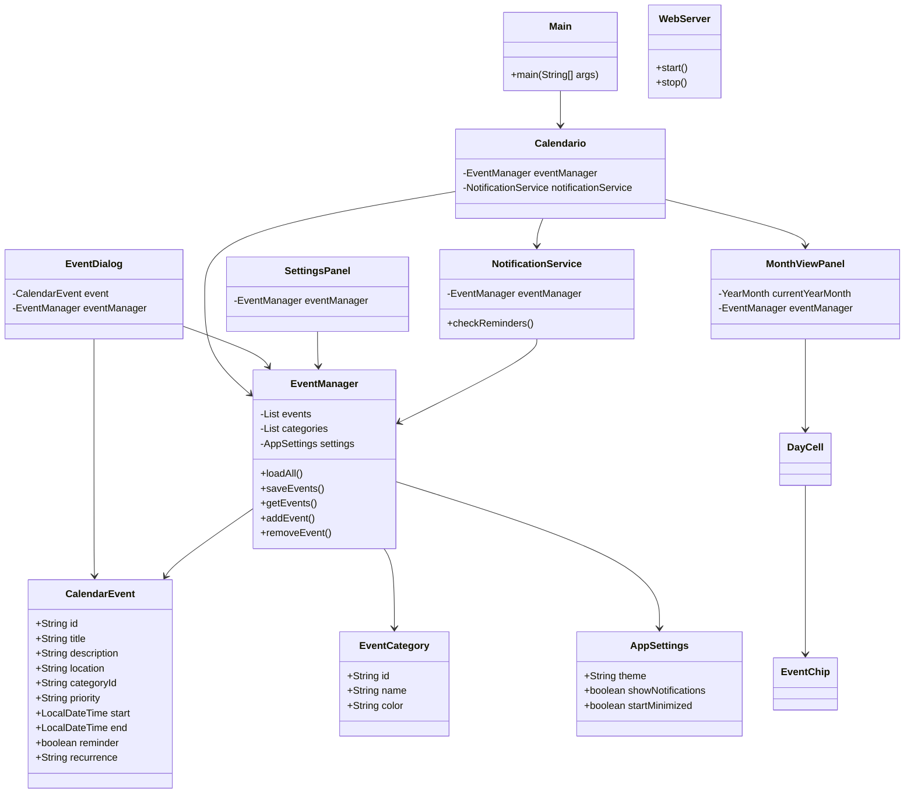
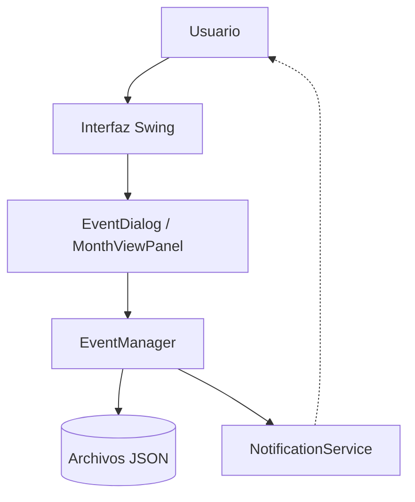

# 📅 Calendario 

##  Descripción

**Calendario** es una aplicación de escritorio desarrollada en Java utilizando Swing y FlatLaf. El proyecto permite gestionar eventos, categorías, recordatorios y configuraciones de usuario mediante una interfaz.

La aplicación almacena la información en archivos JSON locales y cuenta con soporte para:
-  Gestión completa de eventos.
-  Categorías personalizadas con colores.
-  Recordatorios y notificaciones automáticas.
-  Persistencia de datos con Gson.
-  Vista mensual interactiva.
-  Configuración de apariencia (temas).
-  Servidor web integrado.

---

##  Tecnologías utilizadas

| Tecnología | Propósito |
|------------|-----------|
| `Java 21`  | Lenguaje base |
| `Swing`    | Interfaz gráfica de usuario |
| `FlatLaf`  | Tema visual moderno |
| `Gson`     | Serialización/Deserialización JSON |
| `Maven`    | Gestión de dependencias y construcción |
| `JSON`     | Almacenamiento local de datos |

---

## Estructura del proyecto

```text
src/main/java/es/javierdev/
│
├── adapters/
│   ├── LocalDateTypeAdapter.java
│   └── LocalDateTimeTypeAdapter.java
│
├── models/
│   ├── AppSettings.java
│   ├── CalendarEvent.java
│   └── EventCategory.java
│
├── services/
│   ├── EventManager.java
│   ├── NotificationService.java
│   └── WebServer.java
│
├── ui/
│   ├── Calendario.java
│   ├── components/
│   │   ├── DayCell.java
│   │   ├── EventChip.java
│   │   └── MonthViewPanel.java
│   │
│   └── dialogs/
│       ├── EventDialog.java
│       └── SettingsPanel.java
│
├── utils/
│   └── Constants.java
│
└── Main.java
```

> 💡 Los archivos JSON (`calendar_events.json`, `calendar_categories.json`, `calendar_settings.json`) se generan automáticamente en el directorio de trabajo al ejecutar la aplicación.

---

## 🧠 Funcionamiento general del proyecto

La aplicación sigue una arquitectura limpia organizada en capas:

### 1. Inicio de la aplicación
La clase `Main` inicia la interfaz gráfica utilizando `SwingUtilities.invokeLater()` y aplica el tema visual FlatLaf.
```java
 Calendario app = new Calendario();
app.setVisible(true);
```

### 2. Gestión de datos
La clase `EventManager` actúa como núcleo del sistema:
- Carga eventos y categorías desde JSON.
- Guarda automáticamente los cambios tras cada operación.
- Centraliza el acceso a datos para la UI y servicios.

### 3. Interfaz gráfica
La ventana principal se encuentra en `ui/Calendario.java`. Desde aquí se controlan:
- Calendario mensual interactivo.
- Navegación entre meses.
- Creación/edición de eventos.
- Panel de configuración.

| Clase            | Función principal                     |
| ---------------- | ------------------------------------- |
| `MonthViewPanel` | Genera la cuadrícula mensual          |
| `DayCell`        | Representa visualmente un día         |
| `EventChip`      | Muestra un evento dentro de un día    |
| `EventDialog`    | Formulario modal para crear/editar    |
| `SettingsPanel`  | Panel de preferencias del usuario     |

### 4. Sistema de notificaciones
`NotificationService` utiliza `ScheduledExecutorService` para verificar periódicamente los eventos. Cuando la hora actual coincide con un recordatorio activo:
- Se muestra una notificación del sistema.
- El evento se marca como notificado para evitar duplicados.

### 5. Persistencia JSON
Se utiliza **Gson** para mapear objetos Java a JSON. Como Gson no soporta nativamente `LocalDate` y `LocalDateTime`, se implementan:
- `LocalDateTypeAdapter`
- `LocalDateTimeTypeAdapter`

Estos adaptadores garantizan una serialización y deserialización segura y consistente.

---

##  Diagrama de clases



---

## Flujo de funcionamiento


---


## 👨‍💻 Autor
Desarrollado por **Piratemajo**.